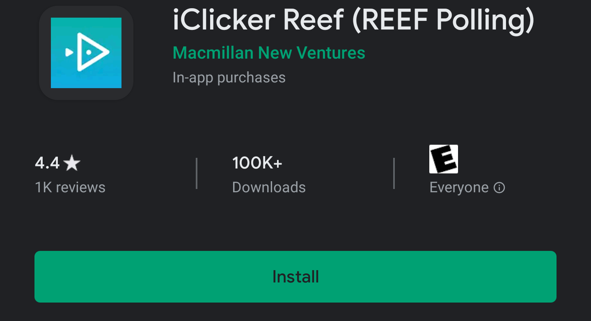
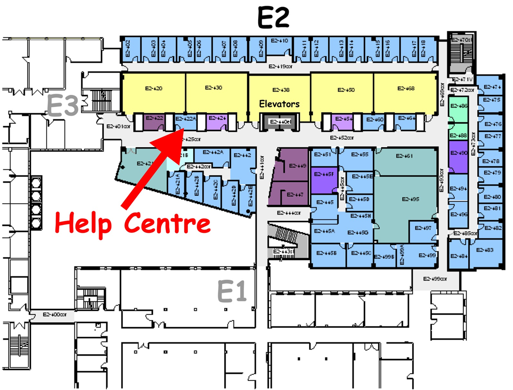
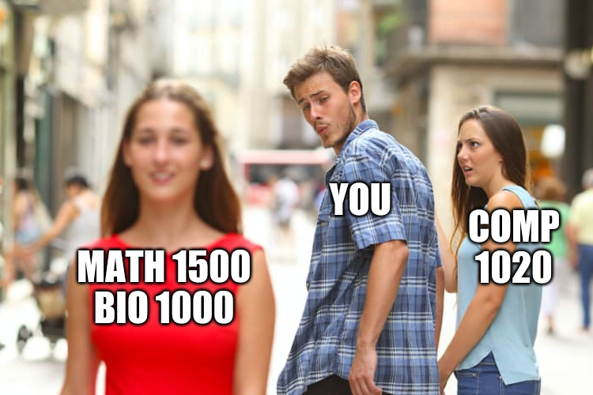

% Course Introduction
% COMP 1020: Introductory Computer Science 2
% Bryan Wodi

# COMP 1020

Instructor Information

> * Bryan Wodi
> * [https://cs.umanitoba.ca/~wodi](https://cs.umanitoba.ca/~wodi)
> * Office: E2 - 460 EITC
> * Office Hours: Mondays & Wednesdays, 9:30 A.M. -- 10:30 A.M.

# COMP 1020
## Class Composition

> - Students in this class must have taken (and passed):
>     * COMP 1010 using Java or Processing
>     * COMP 1012 using Python
>         + There will be some learning on structure and syntax (can be annoying :weary::weary::weary:)
> - 1 week reviewing Java and the differences between Python and Java

# 
## First things first...
> - Course Website :smile:
>   - UMLEARN
>   - [https://cs.umanitoba.ca/~wodi/comp1020](https://cs.umanitoba.ca/~wodi/comp1020)
>     - For slides, and in-class examples
> - **Read** over the Course Outline (ROASS document) on UMLEARN
> - Textbook (optional)
> - Other source, COMP 1010 Wiki: [https://wiki1010.cs.umanitoba.ca/mediawiki/index.php/COMP1010](https://wiki1010.cs.umanitoba.ca/mediawiki/index.php/COMP1010)
>   - Look up "Program a Day". Highly recommend for practice problems.

# 
## Grade Breakdown
- In-class i-Clicker questions and quizzes (with notice): 5% 
- Labs: 10%
- 4 Assignments: 20%
- Midterm: 15%
- Final: 50%

#
## iClicker
- In-class multiple choice questions in *all* lectures throughout the term
- You need an iClicker account.
- To participate in class, You will need _one of_:

:::::: {.columns}
::: {.column width="30%"}
  - The iClicker Reef app 
:::
::: {.column width="70%"}
  - 
:::
::::::

  - A laptop or tablet to sign into your iClicker account
  - An iClicker remote 
- We will do some practice questions in the next class. (Not for marks).

#
## Labs
- 11 labs throughout the term
  - Numbered Lab 0 - Lab 10
  - Lab 0 is optional, not for marks.
- One per week, starting Jan 13. No labs in the week of Feb 17. (Winter Break)
- Final labs will be on the week of March 30.
- Each lab is worth 3 marks
  - 1 for attendance
  - 1 for completing any of the 3 problems. (Bronze, Silver or Gold)
  - 1 for clean, sensible code (T.A.'s discretion)

#
## Assignments
- Submitted using the "Dropbox" tool on UMLEARN
- Follow the Programming Standards document when writing code
- 4 Assignments (instead of 5 :grinning:)
- One every 3 weeks starting from week of Jan 20
  - A1 due on Feb 5^th^ at 11:59 PM CST.
- Late penalty follows the <ins>[Fibonacci Sequence](https://www.mathsisfun.com/numbers/fibonacci-sequence.html)</ins> for each hour late

#
## Academic Dishonesty
- You are required to do 100% of the work yourself

- Getting Help:
  - You can seek help from:
    - Me (or my colleagues) via email or office hours
    - The discussion forum on UMLEARN (do not post code on there)
    - The help centre 
      - Hours can be found <ins>[on their website](https://www.sci.umanitoba.ca/cs/help/)</ins>

# 
## Academic Dishonesty
Honesty Declaration (UMLEARN):

- Click on “Checklist” in the COMP 1020 website (top left corner)
- Click on “Honesty Declaration”
- READ IT, check Agreement, and click Save
- This must be done before you will see the dropboxes for any assignments.
- This is a contract :couple::two_men_holding_hands::two_women_holding_hands::couple_with_heart:

#
## Software
- Dr. Java
- Geany
- Eclipse and the like (beware of packages)
- e.t.c.

#
## Hardware
- Any computer *should* be fine for this course
- University Machines have Java tools available
 
#
## How can you pass this course?
- 
- Pay attention in class/labs
- Ask questions
- Do all the work yourself
  - Understand what you did
- Practice, a lot!

#
## Tasks for you:
- By Wednesday:
  - Set up your iClicker account
    - See the document, "Using iClicker Reef" on UMLEARN
  - Come to class prepared to participate :sweat_smile:
- Sometime soon:
  - Do the honesty declaration
  
#
## 

