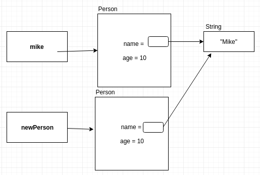

% Introductory Computer Science 2
% Week 4: Using Objects
% Bryan Wodi

# We have discussed..
> * An introduction to objects
> * instance and static variables (and methods)
> * comparing objects

# Rehash on Objects
* It is not a(n):
  * int, double, float, short, long , byte, char, or boolean...
  * <span style="color:red">it is an Object</span>
* This includes:
  * Strings
  * Arrays
  * Classes you create
  * Library classes like Scanner, etc
* Any varible with one of these types store a <span style="color:red">reference</span> to the objects, never the object itself

# Objects containing Objects
## What it looks like:


```java
Person mike = new Person("Mike", 10);
```

#
## Cloning objects
> * Remember: A simple assignment only copies the <span style="color:red">reference</span> (shallow copy)


```java
Person mike = new Person("Mike", 10);
Person newPerson = mike;
```
* To make a new object identical to this object we need to do a **deep copy**

#
## clone() method
```java
public class Person {
    [...]
    public Person clone() {
        return new Person(this.name, this.age);
    }
}

```

#
## Using the clone() method


```java
Person mike = new Person("Mike", 10);
Person newPerson = mike.clone();
```

* What about "Mike"? (immutable).

# 
## Shallow copy vs Clone (Deep copy)
* An assignment `obj1 = obj2` performs a shallow copy
  * references the same object.
  * called an <span style="color:red">alias</span>
  * a change in one will affect the other
* A clone performs a deep copy and **returns a new object**

#
## Cloning arrays
How do we perform a deep copy?
```java
int [] arr = {1, 2, 3, 4, 5, 6};
int [] arr2 = new int[arr.length];

for (int i=0; i<arr.length; i++)
    arr2[i] = arr[i];

// Or using System.arraycopy()
System.arraycopy(arr, 0, arr2, 0, arr.length);

```

[Documentation for `System.arraycopy()`](https://docs.oracle.com/javase/8/docs/api/java/lang/System.html#arraycopy-java.lang.Object-int-java.lang.Object-int-int-)


#
## Arrays of Objects

```java
Person [] people = new Person[4];
people[0] = new Person("Mike", 10);
people[1] = new Person("Xan", 20); 
```


#
## Copying an array of objects
> * Shallow copy:
```java
Person [] peopleCopy = people;
```


> * Deep copy: `System.arraycopy` (or a for loop). <span style="color:blue">_Hint: A1_</span>

#
## Garbage collection
```java
Person mike = new Person("Mike", 10);
mike = new Person("Sandra", 22);
```


> * Java frees up unused memory when nothing references it anymore
> * "memory leaks" occur in other languages

#
## Objects containing Objects
```java
public class Person {
    private String name;
    private int age;
    private Person spouse; // null means no spouse
    private Person [] children; 
}
```

> * We would need to update the constructor

#
## Updated Person constructor
```java
public class Person {
    private String name;
    private int age;
    private Person spouse; // null means no spouse
    // private Person [] children; More on this later 
    
    public Person (String name, int age, Person other) {
        this.name = name;
        this.age = age;
        spouse = other;
        // Make sure the other person is married to you :D
        if (other != null)
            other.spouse = this;
    }
}

```

> * Can we make this cleaner? 

#
## by using a method!
```java
public class Person {
    [...]
    public void setSpouse(Person other) {
        this.spouse = other;
        other.spouse = this; // do a null check before!
    }
}
```

* We can add methods like
  * `public Person getSpouse()`
  * `public boolean isMarried()`
  * We can go crazy with this...

#
## Person containing array of Person(s)
```java
public class Person {
    private String name;
    private int age;
    private Person [] children; 
    
    public Person (String name, int age) {
        this.name = name;
        this.age = age;
        
        children = new Person [4]; // 4 chosen randomly
    }
}

```

#
## Better yet, use a constant
```java
public class Person {
    private String name;
    private int age;
    private Person [] children; 
    
    final static int MAX_KIDS = 4; // Class variable
    
    public Person (String name, int age) {
        this.name = name;
        this.age = age;
        
        children = new Person [MAX_KIDS];
    }
}

```
> * Partially full list.

#
## How do we add children?

`children` is `private` so, we use a method.

We could have:

* `addChild()`
* `adoptChild()`
* `haveChildWith()`

#
## Let's use
* `addChild()`
* Keep track of how many objects in the array
* What will that `toString()` method look like?

#
## Using a related class - `PersonList`
> * Let's add a list of children
> * We can isolate the functionality of a list of Person objects further by creating a separate class
>   * It would have its unique actions
>   * Print the list
>   * Search for a Person in the list
>   * Add/Delete from the list, sort it, e.t.c
> * For the <span style="color:red">`PersonList`</span> class we would need:
>   * A "partially full array" of Person objects
>   * A constructor to make an empty list
>   * Methods: `addPerson(Person p)` and `toString()`


#
## Bonus Activity 

Can a `toString` method call another `toString` method? 

In `Person`'s `toString` method, print out the names of all the children.

If time permits: 


> * Modify "`addChild()`" to only add a Person if they are less than 18 years old
> * Add a "`search()`" method to `PersonList` class.

#
##


#
## Review
* Objects can point to other objects
* Objects can point to other objects of the same type
* Objects could point to themselves

#
##


#
## References

[Java Documentation - OOP Concepts](https://docs.oracle.com/javase/tutorial/java/concepts/)

Slides also contain materials from Dr. Bate, R. Guderian (2019)

Memes created using [imgflip](https://imgflip.com/memegenerator)

Diagrams created using [draw.io](https://www.draw.io/)
