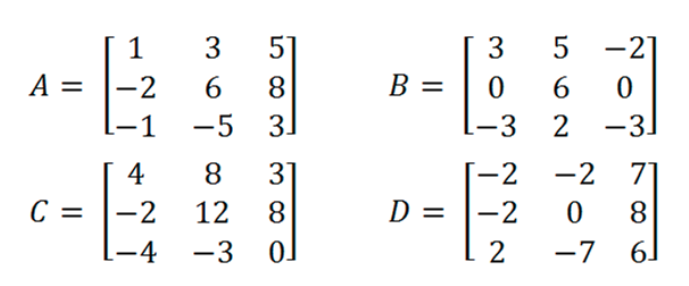
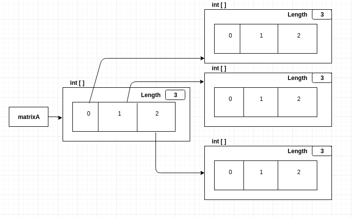
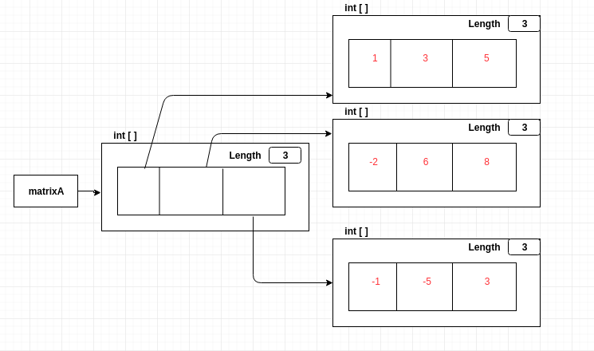
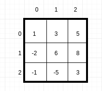
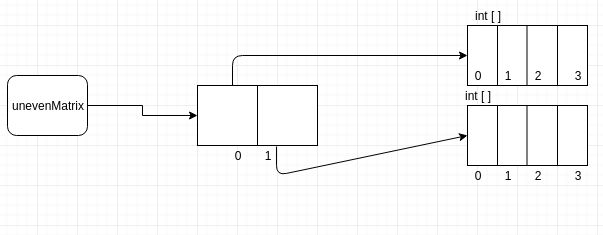
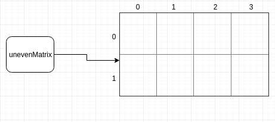
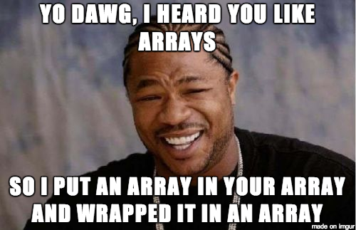

% Introductory Computer Science 2
% Week 5: Multidimensional Arrays
% Bryan Wodi

#
## We have discussed

* Objects
* Differences between objects and primitives
* References to objects

# This week
## Multidimensional Arrays

#
## What are they?

:::::: {.columns}
::: {.column width="40%"}


How can we store a chess board?

:::
::: {.column width="5%"}

:::
::: {.column width="55%"}



Or matices?

:::
::::::

What is special about them?

<aside class="notes">
Multidimensional. Two dimensions in this case.
</aside>


# Arrays of Arrays

Because that it what they are!

How can we store them?

Syntax:

```java
char [][] chessboard = new char[8][8];
int [][] matrixA = new int [3][3];
String [][] fullNameList = new String[10][3];
```
* In Java, you can have an array of any type of data, including another array
* Multi-dimensional arrays can have different lengths (as seen in `fullNameList`).

#
## What does "`matrixA`" look like?


> * `int [][] matrixA = new int [3][3];`



Note: the numbers 0, 1, 2 here show the array index, <ins>not actual data.</ins>

At this point, "`matrixA`" is an empty 2-D integer array.

#
## How is this stored in memory?

```java
matrixA[0][0] = 1;
matrixA[0][1] = 3;
matrixA[0][2] = 5;
matrixA[1][0] = -2;
matrixA[1][1] = 6;
matrixA[1][2] = 8;
matrixA[2][0] = -1;
matrixA[2][1] = -5;
matrixA[2][2] = 3;
```

* Or you can use a loop like a normal human being :joy::joy::joy:

#
## What does "`matrixA`" look like now in memory?




#
## Accessing elements or rows

* By using subscripts "`[]`"
  * `matrixA` gives you the whole array
  * `matrixA[0]` gives you one particular "row". Here, the first row
  * `matrixA[1][2]` gives you one particular element.

#
## Simpler way of thinking about 2D arrays

Best to think of them as a matrix with rows and columns!



* Then `matrixA`[<span style="color:blue">r</span>][<span style="color:red">c</span>] is the element in row <span style="color:blue">r</span> and column <span style="color:red">c</span>

<aside class="notes">
But it is really stored as seen in the previous slides.
</aside>

#
## Creating arrays with uneven rows and columns
```java
int [][] unevenMatrix = new int[2][4];
```

>* This is a matrix with 2 rows, and 4 columns.
>* We can also see it as an array of 2 things, where each thing is an array of 4 int values.

#
## Creating arrays with uneven rows and columns

```java
int [][] unevenMatrix = new int[2][4];
```

>* What really happens.



#
## Creating arrays with uneven rows and columns

```java
int [][] unevenMatrix = new int[2][4];
```

>* What you should imagine happens. :smile:



#
## Other ways of creating multidimensional arrays
>* We have seen how to create arrays with "`new`"
>* We can also use `{ }`
```java
int [][] arr = { {1, 2, 3}, 
                 {4, 5, 6}, 
                 {7, 8, 9} 
               };                   // 3x3 2D-array
                 
int [][][] arr2 = { {{1, 2}, {3, 4}}, 
                    {{5, 6}, {7, 8}}, 
                    {{9, 0}, {1, 2}} 
                  };                 // 2x2 3D-array
```

* How can we access data in these arrays?

#
## Other ways of creating MDAs 

The rows do not need to be the same size

```java
int [][] arr = { {1, 2, 3}, 
                 {4, 5, 6, 7, 8, 9}, 
                 {0} 
               }; 
```

Or do it manually:

```java
int [][] arr = new int [3][]; // 3 unspecified arrays. 
                              // The 3 entries will be null
arr[0] = new int[3];
arr[1] = new int[6];
arr[2] = new int[1];

/** Fill in array **/
```

* **You must set the size of the outermost array to k ≥ 1**


#
## Multi-dimensional Arrays

How do we add more dimensions?

* Add more brackets!


#
## Determining the number of rows and columns of 2D arrays

```java
int [][] arr = new int[3][6];

int numRows = arr.length;    // 3
int numCols = arr[0].length; // 6
```


<aside class="notes">
One backwards thing is the int[3][6] is supposed to be of type int[3],
and there are 6 elements. But Java does things backwards.
</aside>

#
## How can we iterate and display contents of a MDA?

* `for`-loop for <span style="color:red">every dimension</span>


# Activity 1
Create a 3x3 int array and fill it with random values between 1 and 9 (inclusive)

Print the content of the array.

# Activity 2
Given a method signature `public static int sum(int[][][] data)`, write the code
 to get the total sum of the matrix.

#
## Activity 3
Given a method header `public static int getMax(int[][][] data)` that is given a
 3D array, write a method to traverse the data and return the maximum value.

#
## Example Tic-tac-toe

> * How would we store the data?
> * How do we print the data?
> * How can we do a prettier printing of the data?

#
## Tic-tac-toe class

> * Example: put this into a class
> * What methods would this have?

#
## Other real world examples
>* Minecraft
>* Sudoku
>* Monopoly
>* Scrabble, etc

#
## Dimensions can be anything!

* Example: 
    - 1st: Alphabets [`"a" - "z"`]
    - 2nd: Names of students whose last names begin with the _Alphabet_ in 1st dimension
    - 3rd: Names of courses the student is registered in
    - 4th: letter grades for assignments in that course (e.g.) `"A+"`
    - I could go on... :see_no_evil::speak_no_evil::hear_no_evil:

#
## Review

MDA's are simply arrays that contain references to other arrays

They can have separate shapes and sizes

We can access them by using subscripts

#
##

:::::: {.columns}
::: {.column width="50%"}


:::
::: {.column width="50%"}



:::
::::::


#
## Acknowledgements

Slides also contain materials from Dr. Bate, R. Guderian (2019)

Memes created using [imgflip](https://imgflip.com/memegenerator) and [imgur](https://imgur.com/t/memes)

Diagrams created using [draw.io](https://www.draw.io/)
