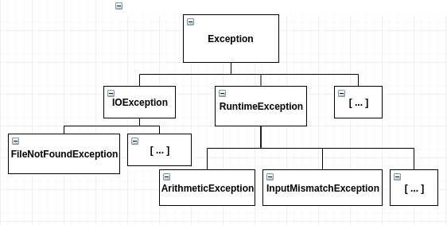
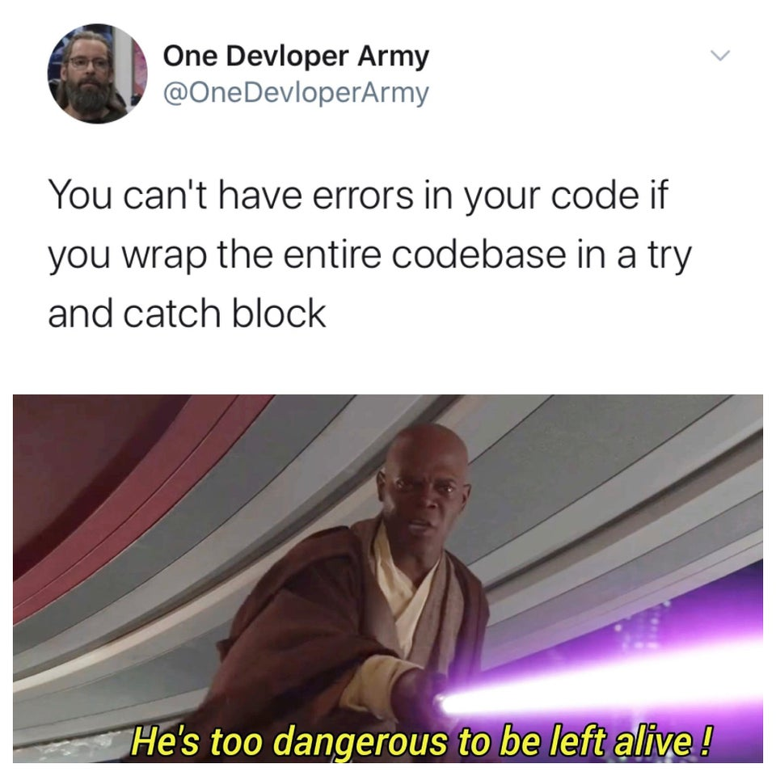
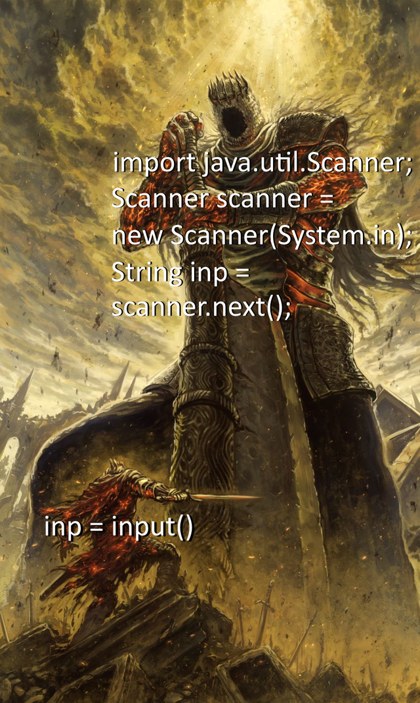
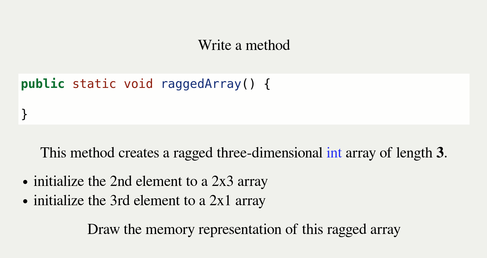

% Introductory Computer Science 2
% Week 6: File IO and Exceptions
% Bryan Wodi

#
## We have discussed

* Objects
* References to objects
* MDAs

# This week
## Exceptions and File Handling

#
## Exceptions
Whenever something goes wrong in Java, an <span style="color:red">Exception</span>
is generated.

* `5/0;` gives an <span style="color:red">ArithmeticException</span>
* `Integer.parseInt("String");` gives a <span style="color:red">NumberFormatException</span>
* `arr[-1] = 5;` gives an <span style="color:red">ArrayIndexOutOfBoundsException</span>
*  <span style="color:blue">null</span>`.getName()` gives a <span style="color:red">NullPointerException</span>

#
## Exceptions are just Objects
Just like __every__ object, they have:

* data: contains information about the exception
  * <ins>what</ins> went wrong, and <ins>where</ins> it happened
* methods: to work with the data

#
## Because exceptions are Objects...

We can define variables of these types

>* <span style="color:red">NullPointerException</span> myException = new <span style="color:red">NullPointerException()</span>;

#
## Some notable methods

* <span style="color:red">String</span> `getMessage()`: gives the message only
* <span style="color:red">String</span> `toString()`: gives the name of the exception and the message
* <span style="color:red">void</span> `printStackTrace()`: shows where the program was when the Exception object was created

* We can add our own message when we construct our Exception object.

[See Documentation](https://docs.oracle.com/javase/8/docs/api/java/lang/Exception.html)

#
## Exception Hierarchy
:::::: {.columns}
::: {.column width="50%"}




:::
::: {.column width="50%"}


:::
::::::

#
## Exceptions are "thrown"

We want methods to have their usual results

as well as

report problems when they happen


#
## Exceptions are "thrown"

`throw` an Exception back to who called this method

Syntax:

```java
public static void method() throws Exception {
    throw new Exception("Meaningful Message");
}
```
<aside class="notes">

 :stuck_out_tongue: Quiz :stuck_out_tongue:
Clear your desk, except for a pen/pencil.

No calculators needed 


(Missing header and sub-header so this stays hidden)

Given the class definition:

```java
public class Thing { }
```
Create a class named **MyObject** that holds an <ins>int</ins> and <ins>one Thing object</ins>.

>* Write a constructor <ins>with no parameters</ins> that initializes the Thing object and 
   sets the int value to 5

```java
MyObject obj = new MyObject();
MyObject another = new MyObject();

obj = another; 
```
>* Draw the memory representation of **obj** and **another** after this code executes.


5 marks total

* 1 mark for:
  * correctly declaring `MyObject` class body (without extra methods) <span style="color:red">and</span>
  * correctly declaring one `int` and one `Thing` instance variables
* 1 mark - correctly __initializing__ the `int` and `Thing` in the constructor
* 1 mark - MyObject instance containing the number `5`
* 1 mark - MyObject instance pointing to a Thing instance
* 0.5 mark - arrow from `another` to a MyObject instance
* 0.5 mark - arrow from `obj` to the MyObject instance `another` points to


</aside>

# 
## Activity

```java
int data[][] = new int[2][3];
for (int i = 0; i < data.length; i++)
    for(int j = 0; j < data[i].length; j++)
        data[i][j] = i + j;

// Draw the memory representation
// of what is in data now.
```

# 
## Activity 2

```java
// Given data from Activity 1...

for (int i = 0; i < data.length; i++)
    data[i] = data[1];
data[0][1] = 100;

// Draw the memory representation
// of what is in data now.
```

#
## Back to Exceptions :point_left:

#
## Catching exceptions

Exceptions must be caught and handled withoutn terminating the program

Syntax:

```java
try {
    // Do something unpredictable
} catch(TypeOfException e) {
    // Jump here if one of those exception happens...
}

// Continue with rest of program...
// (unless some un-caught exception occurs)
```

#
## Catching multiple exceptions

You can choose to catch a specific kind of exception or more than one:

```java
try { 
    // Something unpredictable 

} catch (ArithmeticException ae) {
    // Do something if an ArithmeticException occurs
} catch (NumberFormatException nfe) {
    // Do something if an NumberFormatException occurs
}

// Continue with rest of program...
// (unless some un-caught exception occurs)
```

#
## checked and unchecked exceptions

* Some exceptions do not need to be handled when they occur
  * " / by zero", null pointer, `array[-1]`, etc.
  * they are referred to as "unchecked" exceptions
* Some exceptions <span style="color:red">must</span> be handled
  * We will get a compile-time error without 
    - a `try/catch` block around it, or
    - Throwing an exception from this method to the calling method
  * Most I/O operations are of this type


#
## "checked" Exception example

```java
public static void methodC() {
    // ...
    // Might throw an exception
    readAFile(); 
    
    // ...
} // methodC
```

#
## There are two ways to solve this

>1. <span style="color:red">Catch</span> the exception.


```java
public static void methodC() {
    // ...
    
    try {
        readAFile(); // Might throw an exception
    } catch (IOException ioe) {
        // ...
    }

} // methodC
```

#
## There are two ways to solve this

>2. <span style="color:red">Throw</span> the exception.

```java
public static void methodC() throws IOException {
    // ...
    
    readAFile(); // Might throw an exception
    
    // ...
} // methodC
```

* Now any other method that uses methodC must also catch or throw IOExceptions


#
## What to catch when? (RTFM:smiley_cat:)

Let's look at the [NumberFormatException](https://docs.oracle.com/javase/8/docs/api/java/lang/NumberFormatException.html) docs.


* Method signatures list what a method can throw
* Can throw more than one.

#
## Silly try-catch blocks

Just because you can doesn't mean you should :unamused::unamused:


```java
int [] arr = new int [10];

try {
    for (int i = 0; i< 50000; i++)
        arr[i] = i;
} catch (ArrayIndexOutOfBoundsException e) {
    System.out.println("I guess the loop is over.");
}

System.out.println(Arrays.toString(arr));
```

# 
## Exceptions and `imports`

Some exceptions aren't included normally.

We need to `import` them

[Example](https://docs.oracle.com/javase/8/docs/api/java/io/FileNotFoundException.html)

# 
##



#
## Reading Files

How do they work?

#
## Low level
>* Reading raw bytes from a file
>* This is hard to work with
>* See the [FileReader docs](https://docs.oracle.com/javase/8/docs/api/java/io/FileReader.html)

```java
// if someFile.txt is in the same directory
FileReader f = new FileReader("someFile.txt");

// or full path to the file, wherever it may be.
FileReader f = 
  new FileReader("C:\\Users\\Human\\Desktop\\someFile.txt");
```

#
## BufferedReader
We can wrap the `FileReader` object with a `BufferedReader`

>* Nicer to work with - provides more user-friendly methods
>* See the [BufferedReader docs](https://docs.oracle.com/javase/8/docs/api/java/io/BufferedReader.html)

```java
// if someFile.txt is in the same directory
BufferedReader r = new BufferedReader(f);

// or init the FileReader object in same line
BufferedReader r = 
   new BufferedReader( new FileReader ("someFile.txt"));
```

#
## The BufferedReader interface
Methods

* `.readLine()` - gets a line as <span style=color:red>String</span>, null if no more
* `.read()` - gets a char as an <span style=color:red>int</span>, -1 if no more
* `void close()` - release control of the file. (free memory)
  * Should always be done after any file I/O of any type 


#
## What about reading Types?

`Scanner` can parse types for us

>* `hasNextInt()`, `hasNext`... // gives `boolean`
>* `nextInt()`, `next`... // gives actual data.

```java
BufferedReader br = new BufferedReader(...);
Scanner line = new Scanner(br.readLine()); // 1 String line

// Say line contains:
// 34.3 Fred false -3
while (line.hasNext()) {
    if (line.hasNextDouble())
      System.out.println(line.nextDouble());
    else
      line.next();
}
```

# 
## Reading a whole file using Scanner

`File` &rightarrow; `BufferedReader` &rightarrow; `Scanner`

We can skip the `BufferedReader`

```java
Scanner entireFile = new Scanner(new File("someFile.txt"));
```

#
## Is there a better way? 

Use a `BufferedReader` and tokenize each line by a delimeter

Delimeter can be any character we choose:

* whitespace (`"\\s+"`) - most common
* commas (`","`) - for example with CSV records
* whatever you choose to use, really

#
## What does this look like

```java
try {
    ...
    String line = br.readLine();
    
    if (line != null) {
        // Get rid of leading and trailing whitespace
        line = line.trim();
        // Break up line by whitespaces
        String [] tokens = line.split("\\s+");
    }
    
    
} catch(IOException ioe) {
    // ...
}
```


# Reading a file: Java v Ruby:scream:


<aside class="notes">


Clear your table except for a pencil/pen.

No calculator needed


Write a method 

```java 
public static void raggedArray() { 

} 
```

This method creates a ragged three-dimensional <span style="color:blue">int</span> 
array of length __3__.

>* initialize the 2nd element to a 2x3 array
>* initialize the 3rd element to a 2x1 array


Draw the memory representation of this ragged array 

</aside>


#
## Writing to files

We can write, too.

Low-level... [FileWriter](https://docs.oracle.com/javase/8/docs/api/java/io/FileWriter.html)

> * What are the constructors?
>     - File Object
>     - String Object
>     - Optional true? For appending!

Hard/annoying to use...

#
## Using `FileWriter`

FileWriter is hard to use, wrap with `PrintWriter`. Needs an import of `java.io.*`.

Methods:

* `.print()`/`.println()`
* `.printf()` - `C`-style formatting
* `.format()` - same as `printf()`
* `.close()` - clean up
* A few others, like `println`

#
## Example

```java
String currline = "The line";
try {
    PrintWriter outFile = 
            new PrintWriter(new FileWriter("outdata.txt"));
    System.out.println(currline);
    outFile.println(currline);
    outFile.close();
} catch (IOException e) {
    e.printStackTrace();
}
```

#
## Formatting output

> * `%d` – print a decimal integer here
> * `%6d` – use at least 6 characters to do that (right justify)
> * `%f` – print a floating-point value here
> * `%6f` – use at least 6 characters to do that
> * `%6.2f` – with exactly 2 of them after the decimal point
> * `%s` – print a String here
> * `%n` – print a newline (`\n` character) here

#
## What about non-text files?

How would the number 12345 be stored in a file?

# Extra material from here on
## ASCII

8-bits per character, would need 5 * 8 (40) bits to store it... as a String

#
## Store it as an int

`int`s are 32 bits... we should be able to store our number as a 32 bit integer...

We need to use some diferrent reader/writers!

#
## Binary reader/writers

Low-level ones: `FileInputStream`, `FileOutputStream`

"Wrapper" ones: `DataInputStream`, `DataOutputStream`

#
## Usage

Feels familiar:

```java
DataInputStream in = new DataInputStream(
                    new FileInputStream("rawData.bin"));
DataOutputStream out = new DataOutputStream(
                   new FileOutputStream("rawData.bin"));
```

#
## `DataInputStream`/`DataOutputStream` methods

* readInt(), readDouble(), readLong(), readUTF(), ...
* writeInt(x), writeDouble(x), writeLong(x), writeUTF(x), ...
* UTF == 16 bit characters

#
## Getting user input: Java v Python


#
## Quiz 2




#
##


#
## A2 due Friday


#
## Acknowledgements

Slides also contain materials from Dr. Bate, R. Guderian (2019)

[Java 8 documentation](https://docs.oracle.com/javase/8/docs/api/index.html)

[Java Tutorial on Exceptions](https://docs.oracle.com/javase/tutorial/essential/exceptions/)

Memes from [reddit](https://www.reddit.com/r/ProgrammerHumor/) and [imgflip](https://imgflip.com/)


