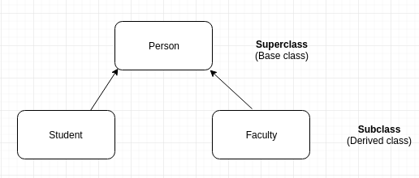
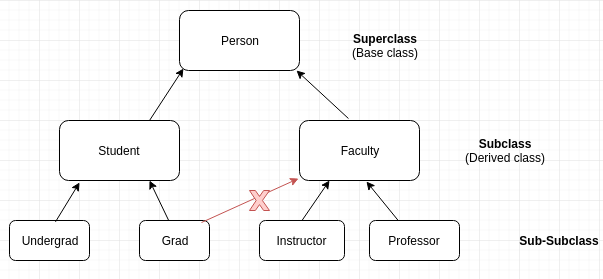

% Introductory Computer Science 2
% Week 7: Object Hierarchies
% Bryan Wodi

# Last Week
* Files and Exceptions
* try/catch

# This week
Object Oriented Programming again

# Recall the `Person` class

We had 3 types of constructors and lots of methods to define a person.

* Encapsulation

#
## Can we do more?
What if 2 objects have a lot in common, <span style="color:blue"> but differ _slightly_</span>?

#
## Person class reshash
```java
// Constructors (3)
Person()                      Person(String name, int age)   
Person(String name, int age, Person spouse)

// Methods
Person clone()                      int getAge()

String getName()                    String toString()

boolean addChild(Person child)      boolean equals(Person p)
boolean removeChild(String name)    boolean isMarried()

void haveBirthday()                 void setAgeTo(int age)
void setSpouse(Person other)
```

#
## Object Hierarchies
* Student vs Faculty member
  * Both are members of the same institution
  * Both are a "Person"
  * But are specialized in different ways
  * We might need objects to store information about particular types of Persons

#
## Solution 1

Create a Student class and Faculty class

Have all the same methods implemented!

* They both get everything!
* BUT:
*  Repeated Code

#
## Solution 2

* Person class holds whatever they have in common
* It will become a <span style="color:blue">super class</span>
* Create classes Faculty and Student as "<span style="color:red">subclasses</span>" or "<span style="color:red">derived classes</span>" of Person

#
## Object inheritance
* Methods and instance variables can be stored at a higher level

* These methods are available to subclasses

#
## How

`extends`

```java
public class Student extends Person {

}

public class Faculty extends Person {

}
```

#
## Class Hierarchy

We just created a "class hierarchy".

Terminology



#
## Hierarchy Tree

We can have subclasses of subclasses

But <span style="color:red">a class can only extend from one class</span>!



#
## Subclasses add more to classes

* The first part of every Person object is the same
* Subclasses can have additional methods, and instance variables
* Making them more and more specialized as we move down the hierarchy

#
## Constructors

We build the objects top down

* first, the "parent" (`Person`)
* then the "child" (`Student`)
* the child's child (`Undergraduate`)
* down the generational hierarchy (`Co-Op`)

#
## Constructors - 2

What if we need to pass parameters to the superclass?

* `super(params)` 
  * this <span style="color:red">must</span> be the first statement in the constructor

#
## Polymorphism

If we need a more specialized behaviour, we can override existing methods

* this means replacing it

#
## Overriding methods

Only works with methods with the <span style="color:red">same signature</span> of the superclass.

* not just the same name
* Still, the overridden method can still be used 
  * hint: `super.methodName(...)`
  * this means "use the superclass method methodName"

# Shadowing variables

We can override variables the same way as we do methods

* But why?
* Please don't.
* But how?
  * `super.variableName`
  
#
## Visibility

`private` is no good in the superclass

* `Student` can't access <span style="color:red">private `name`</span> 
* can use accessors/mutators
  * very secure
  * more code... striving to be lazy
* <span style="color:red">`protected`</span>
  * Gives subclasses access to instance variables
  * [Docs](https://docs.oracle.com/javase/tutorial/java/javaOO/accesscontrol.html)

#
## Type compatibility

>* All subclasses of a class are an instance of that class
>* So, we can store subclasses in variables typed as the superclass

```java
Person p = new Student(); // OK.
Student s =new Person();// Bad. Not every Person's a Student 
```

* Polymorphism calls the correct methods

#
##


#
## Casting

A superclass might not have all the methods we need

Example: `Student` has a "<span style="color:red">`getStudentNumber()`</span>" 
and `Person` doesn't

```java
int studentNum;
Person person = new Student("sandy", 25);

// We can do a one-liner:
studentNum = ((Student)person).getStudentNumber();

// Or
Student s =  (Student)person;
studentNum = s.getStudentNumber();
```

#
## But wait...

What happens when you try to cast to the wrong type?

* `ClassCastException` :joy::joy::joy:

#
## Checking before casting

By using the "`instanceof`" operator.

```java
Person person = new Student("sandy", 25);

if (person instanceof Student)
    studentNum = ((Student)person).getStudentNumber();
else
    System.out.println("Yo this person is not a student!");
```

#
## When to use `instanceof`

>* When dealing with a list of objects where subclasses need to be handled differently

```java
Person [] people = new Person[5];

people[0] = new Student("Daniel", 19, 7737129);
people[1] = new Student("Blessing", 18, 6756435);

people[2] = new Faculty("Robert", 30, 6);
people[3] = new Faculty("Sarada", 26, 31);

people[4] = new Person("Michelle", 22);
```

# Activity

Given an array of Person objects, for each Person, conditionally print:

>* Their student number, if Person is a student
>* How many books they own, if Faculty
>* The result of their `toString()`, if just a regular Person


#
## Polymorphism at run time

```java
for (Person p : people)
    System.out.println(p);
```

Polymorphism chooses the "correct" method to call <span style="color:red">dynamically</span>, 
at run time.

This is based on the **type of the object itself**, not the type of the variable.

#
## Dynamic Polymorphism

The code below has the effect:

```java
Person p;
p.toString();
```

* `if (p == null) throw new NullPointerException`
* `else if(p instanceof ` <span style="color:blue">` Faculty`</span>`)`, call <span style="color:blue">` Faculty's toString()`</span> with "`this = p`"
* `else if(p instanceof ` <span style="color:green">` Undergraduate`</span>`)`, call <span style="color:green">` Undergraduate's toString()`</span> with "`this = p`"
* `else if(p instanceof ` <span style="color:red">` Student`</span>`)`, call <span style="color:red">` Student's toString()`</span> with "`this = p`"
* `else`, call <span style="color:purple">` Person's toString()`</span> with "`this = p`"


#
## `instanceof` and subclasses
```java
Person p = new Student();
System.out.println(p instanceof Person);
```

What would this return?

* `true`. As Student **is** an instance of Person
* Student is a subclass of Person
* If you are type-compatible, you are an instance

#
## The ultimate superclass

If we keep calling `super`...

We will get to <span style="color:red">Object</span>

<span style="color:red">All</span> classes inherit from <ins>[the Object class](https://docs.oracle.com/javase/8/docs/api/java/lang/Object.html)</ins>

```java
Object [] arr = {
    "String literal",
    new int [] {1, 3, 5},
    new Student("Tortilla", 18, 7833821),
    new Scanner(System.in),
    new FileReader("somefile.txt")
};
```

#
## Object methods

* `toString()` - by default returns a String like "`Person@2f50a`"
* `clone()` - makes a deep copy, returns `Object`
* `equals()` - checks equality. Defaults to `==`, returns `boolean`

#
## Polymorphism notes

>* All methods in the different classes must have the <ins>same signature</ins> (not just name)
>* The superclass must have the same method, not just subclasses. Usually a "dummy"
>* Example: `Object`'s `toString()` method
>   * Therefore any object has this method.


#
##


#
## `abstract` classes

Classes that force you to implement their interface.

Prescribe methods that must be defined.

* These classes cannot be instantiated (e.g.) `superclass Pet`
* The methods are too "<span style="color:purple">`abstract`</span>" to be filled at the superclass level

#
##


#
## Acknowledgements

Slides also contain materials from Dr. Bate, R. Guderian (2019)

[Java Tutorial on Inheritance](https://docs.oracle.com/javase/tutorial/java/IandI/subclasses.html)

Memes from [imgflip](https://imgflip.com/) and [reddit](https://www.reddit.com/r/ProgrammerHumor)
