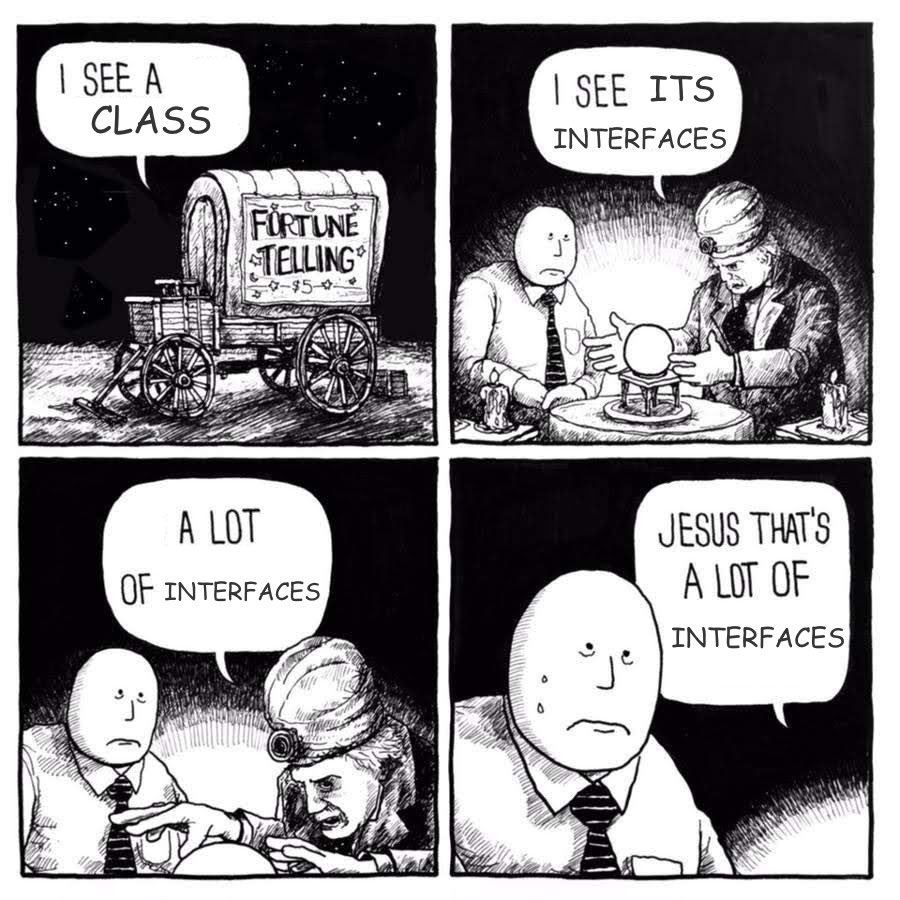
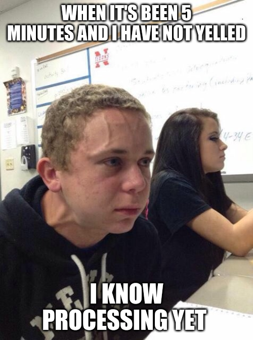
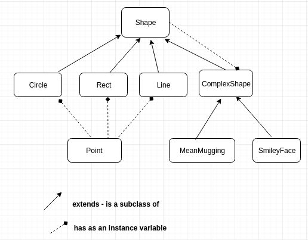
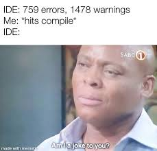

% Introductory Computer Science 2
% Week 8: Object Oriented Programming, Again
% Bryan Wodi

# Last Week
* Object hierarchies
* `abstract` classes

# This week
Object Oriented Programming again (again :smiley:)

# What's new?

Graphics

# The plan
* Building a library of `Shapes`
  * Shapes will have shared methods
  * Polymorphism
* Commonalities?
  * `draw()` - draw a shape
  * `colour` - what colour it is
* We can have compound shapes
  * shape of shapes
  
# 
## Using StdDraw

We will use the StdDraw package

* [Code (one .java file)](https://introcs.cs.princeton.edu/java/stdlib/StdDraw.java.html)
* [Documentation](https://introcs.cs.princeton.edu/java/stdlib/javadoc/StdDraw.html)


#
## The window

* (0, 0) is bottom left
* (1, 1) is top right

* Points have to be `double`s

#
## `class Point`

Helper. Holds X and Y coordinates.

#
## `class Shape`

Version 1:

> * method `draw()`
> * .... that's it!
> * more later?

#
## First shape: Circle

* Need a center point, and a radius.
* Wrap `StdDraw.circle`

#
##


#
## Second shape: Rectangle

* Need a center point, halfWitdth, halfHeight
* Wrap `StdDraw.rectangle`

#
## Third Shape: Line

* Need start point and end point
* Wrap `StdDraw.line`

#
## Now what?



>* Collection of `Shapes`?

#
## Collection of Shapes

>* We can make a complex drawing made up of different shapes  


```java
public class ComplexShape extends Shape {

    private static final int MAX_SHAPES = 20;
    private Shape [] shapes;
    private int numShapes;
    
    ...
}
```


#
## Version 2: Add color
* Let's make solid colours of shapes
* We'll have to make the lines thick
* Relevant `StdDraw` commands
  * `StdDraw.setPenColor(Color c)`
  * `StdDraw.setPenRadius(double r)`
* Color class can be found in `java.awt.Color`
  * [Docs](https://docs.oracle.com/javase/8/docs/api/java/awt/Color.html)

#
## Version 3: types of `ComplexShapes`

* Can make a `MeanMugging` class as a type of `ComplexShape`  :angry:
* `SmileyFace` class too :smile:

#
## Classes so far


#
##


#
## Acknowledgements

Slides also contain materials from Dr. Bate, R. Guderian (2019)

[StdDraw library from Princeton](https://introcs.cs.princeton.edu/java/stdlib/javadoc/StdDraw.html)

Memes from [imgflip](https://imgflip.com/) and [reddit](https://www.reddit.com/r/ProgrammerHumor)
