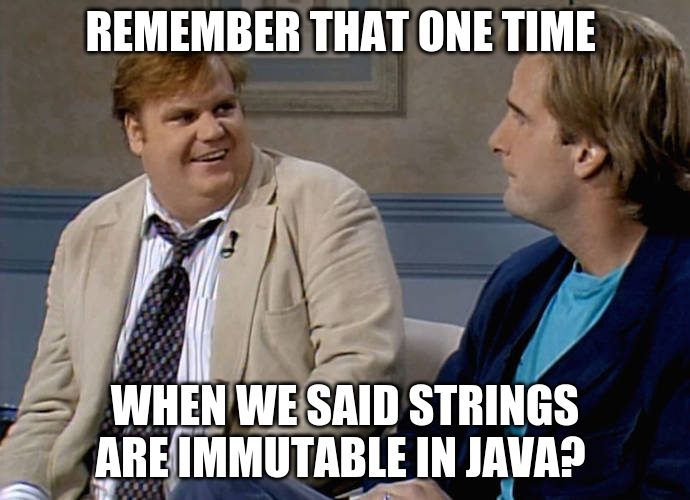
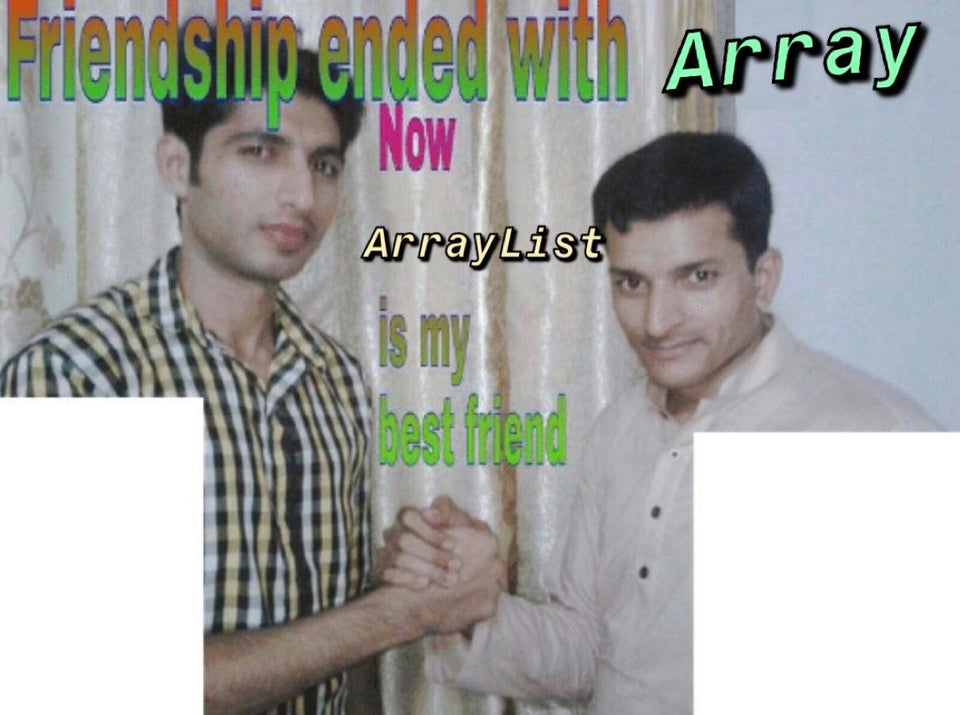

% Introductory Computer Science 2
% Week 9: Strings, ArrayLists
% Bryan Wodi

# Last Week
* OOP with graphics

# This week
Strings and ArrayLists

# Strings

We have seen:

* `.length()`,
* `.charAt()`, 
* `.equals()`,
* `.equalsIgnoreCase()`

# 
##


#
## YES

`String`s are immutable in Java

* We cannot change them
* Need to modify a `String`? A `new` String is created

#
## Immutability of Strings

Since we cannot change our strings, the methods...

* `.toLowerCase()`
* `.toUpperCase()`
* `.trim()`
* `return` a new string with the modifications
* original string is intact


#
## Fun with strings

Example: [Palindromes](https://en.wikipedia.org/wiki/Palindrome)

Some Palindromes: "Hannah", "top spot", "Stanley Yelnats"

Ignore all punctuation, whitespace, and capitalization

* Methods we'll need to use
    * `trim()`
    * `toLowerCase()` (or upper...)
* Now what?
    * clean string, be rid of spaces

#
## How do we sort strings?

we know a < b, q < z

* is A > a?
* is @ > $
* `.compareTo()`
    * returns the 'difference' of the words
    * returns 0 if they are equal
    * [docs](https://docs.oracle.com/javase/8/docs/api/java/lang/String.html#compareTo-java.lang.String-)

#
## Searching strings

* `indexOf()`
    * find the first position of a string within the other string
* `lastIndexOf()`
* `substring()`
    * extract a part of a string from the larger string
    * accepts 1 or 2 parameters
        * start, end - start the substring at `start`. Go up to `end`, if `end` is provided.

#
## Example

Break up a url: `http://google.com`

Get just the domain name, then the TLD.

#
## Easier way?

Of course!

But it's crazy? [Split](https://docs.oracle.com/javase/8/docs/api/java/lang/String.html#split-java.lang.String-)~

```java
myString.split("delimiter");
```

Breaks up a string based on a delimiter, and the delimiter is a regular expression

#
## `split`, usually...

We frequently just do

```java
myString.split("\\s+");
```

Which breaks up a string on all whitespace.

#
## Strings, notables

Methods that you should know:

* length
* charAt
* equals
* equalsIgnoreCase

#
## Strings, conclusion

We do a lot of string processing as programmers

Dates are the worst.

* The.
* Worst.
  * [date formats](https://docs.microsoft.com/en-us/dotnet/standard/base-types/standard-date-and-time-format-strings)
* Followed shortly there after by names
    * John van Rees - what's his last name?

#
## 


#
## ArrayLists

Some of you have seen these: you can now have a nap.

Arrays are fixed-length in Java (and all proper languages). 

We've used partially-filled arrays, but...

#
## 


#
## If only...

we could have an array that adjusts its size for us

[ArrayList](https://docs.oracle.com/javase/8/docs/api/java/util/ArrayList.html)

> * Has tradeoffs
> * Slower than arrays
> * Can only hold Objects
>     * Kind of... (more later)

#
## Tell me more

Instantiation:

```java
import java.util.ArrayList;
```
```java
ArrayList list = new ArrayList()
list.add("Hello there");
list.add("Bonjour");
```

#
## What the...

Warnings?

```
ArrayList is a raw type. References to generic type ArrayList<E> should be parameterized
```


#
## Generics

OOP chapter 5: Putting objects into a generic list

By default, it accepts objects of type Object (and it's subclasses)

We can, and should, specify what kind of objects we are storing.

#
## Generics

Generic programming: "The type will be defined later"

ArrayLists can hold any Object, generic in that it's not tied to just one type.

#
## Specifying the type

```java
ArrayList<String> list = new ArrayList<String>();
list.add("Riddikulus");
list.add("Expelliarmus");
```

`ArrayList`s  will to type-checking for us. Should be less error-prone

#
## What about

```java
ArrayList<int> list = new ArrayList<int>();
```

Error

* Objects only!

#
## What about the Wrapper Class?

```java
ArrayList<Integer> list = new ArrayList<Integer>();
```

Yes! This works

#
## Auto-boxing, Auto-unboxing

```java
ArrayList<Integer> list = new ArrayList<Integer>();
list.add(3);
```

Works. `int` gets 'boxed' into its wrapper class automagically.

#
## `ArrayList` methods

* `.add(someObject)` - add an object to our list
* `.get(x)` - Get an object at index `x`
* `.set(x, o)` - Set object at spot `x` to `o`
* `.size()` - how many objects are in our list
* `.remove(int x)` - remove an element at index `x`
* `.remove(Object o)` - Find an object that is equal() to `o`, and remove it
* removing items shifts all the items to the right of it to the left (kind of)
* `.clear()` - remove ALL OF THE THINGS

#
## Find things

* `.indexOf(Object o)` - find the first instance of this object
* `.lastIndexOf(Object o)` - take a wild guess...
* Does `.equals()` to check equality
    * That's a good thing
    * How is that different than `==`
* returns -1 if it is not in the list

#
## Arrays vs `ArrayList`s

Array                        Arraylist
-----                        ---------
String[] a =new String[10];  ArrayList<String> a = new ArrayList<String>( );
a.length                     a.size( )
a[0]                         a.get(0)
a[0] = "test"                a.set(0, "test")

#
## Arrays vs `ArrayList`s 2

Array                        Arraylist
-----                        ---------
&nbsp;                       a.add("new")
&nbsp;                       a.remove(0)
Any type, but only one type  Objects only

#
## Example

While loop to add input to a list

#
## Example 2

Remove duplicates

#
## Arrays of Objects

What if we do

```java
ArrayList<Object> list = new ArrayList<Object>()
```

What can we hold? Is it a good idea?

#
##


#
## Acknowledgements

Slides also contain materials from R. Guderian (2019)

Memes from [imgflip](https://imgflip.com/) and [reddit](https://www.reddit.com/r/ProgrammerHumor)
