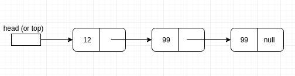
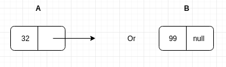
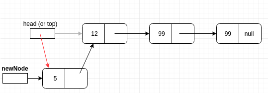
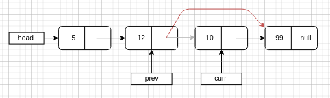
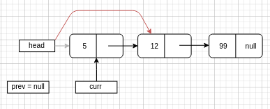
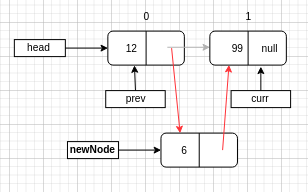
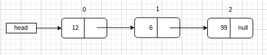

% Introductory Computer Science 2
% Week 10: LinkedLists
% Bryan Wodi

# Last Week
* Strings
* ArrayLists

# This week
LinkedLists and linked structures

#
##


# 
## Benefits of Arrays
* full and partially-full
  * fast 
  * fixed size
  * predictable size

# 
## Benefits of ArrayLists

* Elastic arrays
* They are really just partially-full arrays written by someone else
* [Implementation](http://hg.openjdk.java.net/jdk8/jdk8/jdk/file/tip/src/share/classes/java/util/ArrayList.java)
  
# 
## Commonalities

Both have two things in common

* <span style="color:red">Physical adjacency</span>
  * updating the middle (or front) of the list requires shifting over elements
* Array might become full
  * Would need to rebuild the array into a new one 
  
#
## Can we do better?

Design goals:

* take up only as much space as we need
* flexibility
  * hold any kind of object
  * traverse in any way
* simple insertion/deletion
  * do not want to shift items manually
  
#
## LinkedLists - what do they look like (a train)

 

* The data is stored in a set of <span style="color:red">Node</span> objects
* Each node contains:
  * data (or a reference to it)
  * a reference to the next Node in the list (null if there isn't one)
* A "head" pointer (reference to the first Node)
  * gives access to all of the Nodes
  * think of head as a door

#
## class `Node`

Holds data and a link to the next node (or null if at the end of the chain)



```java 
class Node {
    private Object data;
    private Node next;
    
    /** accessors and mutators **/
}
```

#
## Generic LinkedList

```java
class LinkedList {
    private Node head; // reference to first node
    
    /** accessors and mutators **/
}

```

#
## Constructors

class `LinkedList`

```java
public LinkedList() { 
    head = null; // It's null by default 
}

```

class `Node`

```java
public Node(Object data, Node nextNode) {
    this.data = data;
    this.next = nextNode;
}
```

#
## Accessing data

We need accessor (and maybe mutators) for the data contained in a `Node`

`Object myObj = myNode.getData()`


#
## Accessors and mutators

We need getters and setters for `Node`s

```java
    // Getters
    public Object getData() { return this.data; }
    public Node   getNext() { return this.next; }
    
    // Setters
    public void setData(Object data) { this.data = data; }
    public void setNextNode(Node next) { this.next = next; }
```

#
## Adding to the LinkedList

It is easier to add items to the start of the list

Unlike arrays (at the end)

```java
    public void add (Object data) {
        Node newNode = new Node(data, head);
        head = newNode;
    }
```

* 

# 
## Displaying the LinkedList

```java
LinkedList myList = new LinkedList();
myList.add(5);
System.out.println(myList);
```

* No
* That would be too easy
* This just prints the memory address

# 
## Displaying the LinkedList - 2

We are defining a new data type!

We would need to provide a `toString()`

* But how?
* We have to "walk the list"

#
## `toString()`

* start at the head, print
* move to next node, print
* repeat
  * until...?

#
## 


#
## Deleting from LinkedLists

Deleting the `Node` containig the data 10 



* search through the list with two `Node` pointers: <span style="color:red">`prev`</span> and <span style="color:red">`curr`</span>
* we need to remove the reference to the intended `Node` to delete
* `prev.setNextNode(curr.getNextNode())`

#
## Edge Case: Deleting the first node

Values of `prev` and `curr` when deleting the `Node` containig the data 5? 



* If `prev` is  `null`, it means the we are deleting the first `Node`
* `head = curr.getNextNode()`

# 
## Inserting at a particular location

Inserting a `Node` containing the data 6 at position 1



* similar to the `ArrayList`'s `add(index, obj)`
* how?
  * walk to the location
  * put the node between `prev` and `curr`
  * 

#
## Edge Cases: Inserting at start and end of list

```java
public void add(int position, Object obj) { ... }
```

If the `position` is 0, call the `add(obj)` method.

If not, walk the list!

# 
##


# 
## There's more - Ordered Insertion

We can keep the list sorted by performing ordered insertion!

We can perform this using the `compareTo()` method as seen in the `ArrayList` example.


# 
## Pro/Con of LinkedLists

* Easy inserts and deletes - no shuffling compared to Arrays/ArrayLists
* But, no direct access to nodes. Need to walk through the list to a node

# 
## Conclusion

There are various benefits and drawbacks of different lists.

The choice of the data structure to use depends on what operation you will be 
performing the most.

See the [Big-O Cheat Sheet](https://www.bigocheatsheet.com/) for some of the 
"costs" of using these data structures.


# 
##


#
## Acknowledgements

Slides also contain materials from Bate & R. Guderian (2019)

Memes from [imgflip](https://imgflip.com/) and [reddit](https://www.reddit.com/r/ProgrammerHumor)
