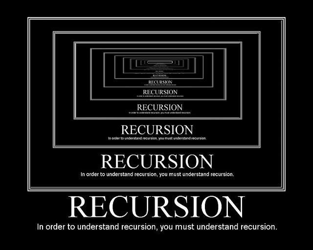
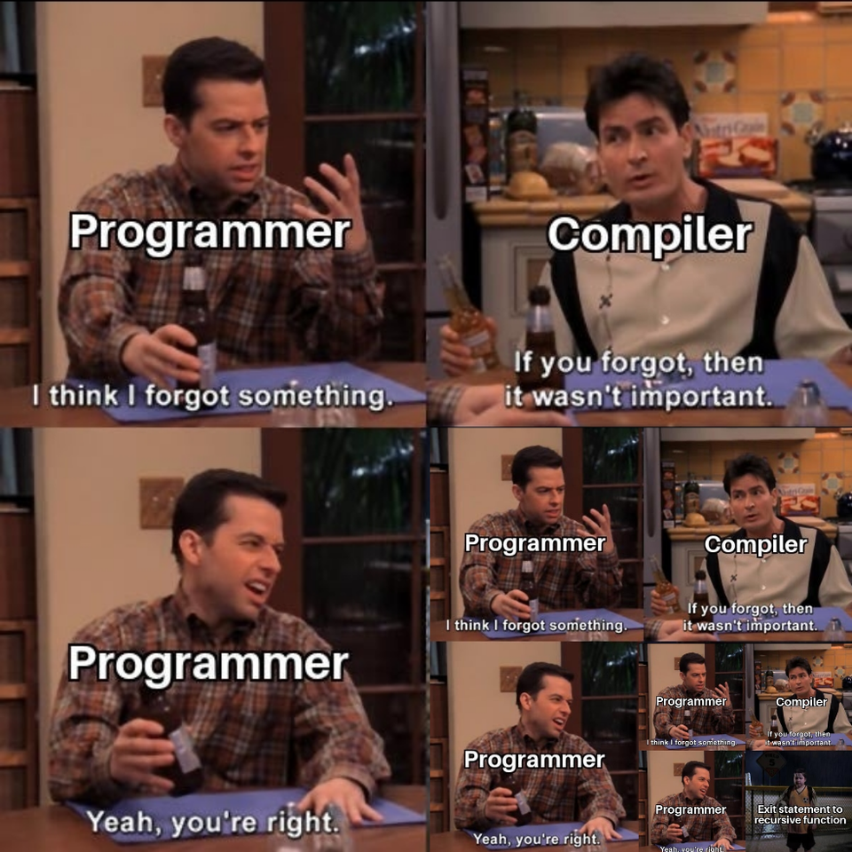
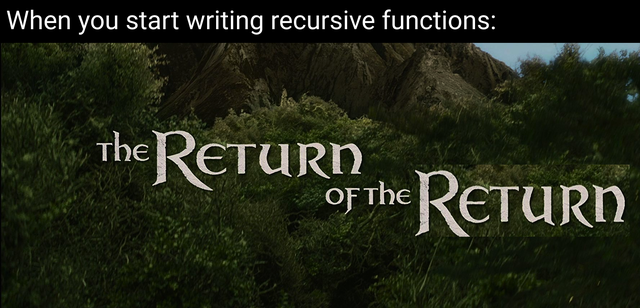

% Introductory Computer Science 2
% Week 11: Recursion
% Bryan Wodi

# Last week

> * Linked Lists

# This week

Recursion

#
## What is it?

A method that calls itself

* That's it
* That's a wrap
* Go home

#
## Still here?

Let's play

#
## How it's done

A rite of passage: factorial

* $n! = \prod_{i=1}^{n} i$
* $3! = 3 * 2 * 1$


#
## Factorial loop

Pretty easy `for` loop

#
## Factorial recursion

What is the recursive case?

$3! = 3 * 2!$

Recursive subproblem!

#
## How?

```java
public static int fact(n) {
    return n * fact(n-1);
}
```

* See any problems?

#
## Infinite recursion



An infinite loop?

#
## Writing recursion

1. Write a recursive case
2. Write a base case (stopping point)
3. HODL

* How do we fix the factorial?

#
## Example: summation

Do the calculation $$\sum_{i=0}^{n} i$$

* recursive case?
    * `sum(i) = i + sum(i-1)`
* base case?
    * `i == 0`


#
## Example 2: Power 2...

Do the calculation $2^n$

* Need to pass n, count down every time
* recursive case?
    * `pow2(i) = 2 * pow2(i-1)`
* base case?
    * `i == 0`
* Passing the state to terminate

#
## Recursion in Linked Structures

Actually really nice

Example: Do a search in a linked list, return index of item if it is in the list

#
## Search a sorted list

Is value $x$ in the list. Return the index.

* Recursive case?
    * More than one element: go left or right
* Base case?
    * one element, am I equal to $x$?
    * zero elements: it's not here.

#
## Tail Recursion

The simplest type of recursion:

* The recursive call is the last line of the function
* All loops can be written as tail recursion
* See [this YouTube video](https://www.youtube.com/watch?v=o2nQDij5eqs) explaining (head and) tail recursion

#
## Multiple recursion

Incredible benefits when used correctly

Divide the problem into chunks, deal with each smaller chunk

#
## Example: All permutations

Generate all permutations for 4 digits

ie: 0000, 0001, 0002,... 9999

Store the values in an ArrayList

(See Permutations.java in the Examples folder)

#
## How?

* Recursive Case
    * iterate 0-9 for this digit + perm(the rest of the digits)
* Base Case
    * We are out of digits to iterate

(See Permutations.java in the Examples folder)

#
## H-Tree

A [H-Tree](https://en.wikipedia.org/wiki/H_tree) is a fractal geometric shape 
that consists of repeating patterns that resembles the letter "H"


#
## H-Tree

Given:

>* The centre point of the screen `(x,y)`, and
>* The length of a line. (Assume all 3 lines have equal length)

Let's write a method to draw this! (Using the `StdDraw` Library)


```java
public static void drawHTree(double x, double y, double len){

}

```
#
## How?

At the centre!

Start by drawing a simple "H". Use a piece of paper to visualize the points

```java
// Given x and y, we can get x0, y0, x1, y1

/*
              y1
              |
              |
      x0 ---(x,y)--- x1
              |
              |
              y0
*/

```


#
## H-Tree (cont'd)

Now we have drawn a "H", recurse!

* We need a `level` param telling us how deep to go!
* Base case?
  * `level == 0`
* Recursive case?
  * draw a "H" 4 times!
  * but... what do we pass?

# 
##


#
## Recursion pitfalls

Sometimes, we can do it wrong:

Fibonacci sequence:

> * `fib(0) = fib(1) = 1`
> * `fib(n) = fib(n-2)+fib(n-1)  [for n≥2]`

#
## Fibonacci cases:

Basically spelled out in the definition

> * Recursive case:
>    * fib (n) = fib(n-2) + fib(n-1)
> * Base case
>    * fib(0) = 1, fib(1) = 1

#
## What could possibly go wrong

Let's draw this...

* Repeating work already done!
* Fewer lines of code/ease of code != speedy code

#
## Using it right

Backtracking algorithm

> * check if a case can exist
> * if not, try again a different way

#
## Solve a maze

Use a backtracking algorithm - follow the right-hand wall

* Code:
    * at a spot, visit all unvisited neighbouring spots
    * ... That's it!
* Base case:
    * We're at the end
* Recursive case
    * We're not at the end, visit neighbours

#
## How?

Pseudocode:

```
maze(board, x, y){
    board.thiscell.visited = true
    if (board.thiscell == goal)
        return success
    if (!success and canGoLeft and board.left.unvisited)
        success =  maze(board,x-1, y)
    if (!success and canGoUp and board.up.unvisited)
        return maze(board, x, y-1)
    // the same for right and down
    return success
}
```

#
## Why

Tries each path, returns to forks in the road
to visit new paths

Uses the stack as memory!

# 
##



#
## Acknowledgements

Slides contain materials from R. Guderian (2019)

Memes from [imgflip](https://imgflip.com/) and [reddit](https://www.reddit.com/r/ProgrammerHumor)
