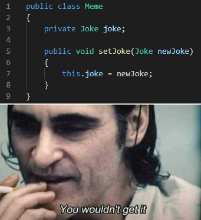

% Introductory Computer Science 2
% Final Exam Topics :see_no_evil:
% Bryan Wodi

# Topics

> 1)      Basic OOP

> 2)      Multi-D arrays

> 3)      Files/Exceptions

> 4)      OOP with inheritance

> 5)      Strings/ArrayLists

> 6)      Linked Lists

> 7)      Recursion

> 8)      Searching / Sorting


# Basic OOP (no inheritance)

> * A class defines a new object types
> * All object types are stored as references
> * All object types are stored as a references
> * Actual objects are create by new
> * Instance variables are stored in individual objects
> * Instance methods are always applied to the this object 
>   * Don't write "<span style="color:red">this.x</span>" inside the class unless there's a duplicate name.
> * Constructors are special methods that create objects (no return type, same name as class)
> * Class variables/methods are defined using static
>   * One for the entire class, not one per object


#
## Basic OOP, e.t.c.

> * Visibility:
>   * <span style="color:red">private</span>: only this class file
>   * <span style="color:red">protected</span>: this class file, and subclasses 
>   * <span style="color:red">public</span>: visible from everywhere
> * Shallow vs Deep copy, know the difference in concept and in code

#
## 



# MDAs

> * Simply an array of arrays
> * `int [2][3]` means an array of 2 `int[3]` objects
> * Ragged arrays: Rows can be of different sizes
>   * `int[3][]` is an array of 3 `int[]` objects, all equal to `null` initially
>   * The first size (3) must be specified

#
## 


# Files/Exceptions
## 1 of 4: Creating Exceptions

> * Exceptions are objects. (every non-primitive datatype in Java is, really)
>   * All Exceptions are subclasses of `Exception`
>   * created using <span style="color:red">`new ExceptionType("message")`</span>
>   * are also created automatically when an error occurs
> * Objects have methods:
>   * `getMessage()`, `printStacktrace()`, `toString()`
> * Exceptions can be intentionally created and thrown
>   * <span style="color:red">`throw new ExceptionType("message")`</span>
>   * Like a `return` statement, the method is terminated when an Exception is thrown

  
# Files/Exceptions
## 2 of 4: Dealing with Exceptions

> * You can catch Exceptions with `try/catch`
>   * <span style="color:red">`try { ...code... } catch(ExceptionType e) {...}`</span>
>   * if an `ExceptionType` is thrown in `...code...` then it will be caught, and the catch block `{...}` will be executed.
>   * only the remainder of the `...code...` block is terminated, not the entire method
> * You can also add "`throws`" to the method header
>   * then, any `Exception` of that type anywhere in the method will be thrown back to the caller of the method
>   * the caller has to catch it (`try/catch`) or use "`throws`" itself

#
## 


# Files/Exceptions
## 3 of 4: File Input

> * <span style="color:red">`new FileReader(String)`</span> or <span style="color:red">`new FileReader(File)`</span>
>   * opens a low-level input file. Difficult for us humans to work with, so:
> * <span style="color:red">`new BufferedReader(FileReader)`</span>  
>   * "wrap" a FileReader in a BufferedReader. Easier for humans to interact with
> * `BufferedReader` methods:
>   * `String readLine()` - returns `null` for end-of-file (EOF)
>   * `int read()` - reads one character at a time, returns `-1` for EOF  
>   * `void close()`
> * Note from Bryan: I am totally ignoring `Scanner` :smirk::smirk::smirk::smirk:


# Files/Exceptions
## 4 of 4: File Output

> * <span style="color:red">`new FileWriter(String)`</span> or <span style="color:red">`new FileWriter(File)`</span>
>   * opens a low-level output file and erases it (if it exists)
> * <span style="color:red">`new FileWriter(String, true)`</span> or <span style="color:red">`new FileWriter(File, true)`</span>
>   * opens a low-level output file and **appends** to it
> * <span style="color:red">`new PrintWriter(FileWriter)`</span>  
>   * "wrap" a FileWriter in a PrintWriter.
> * `PrintWriter` methods:
>   * `print(), println()`
>   * `void close()`

#
## 


# OOP with inheritance - 1 of 3 

> * <span style="color:red">`extends`</span> creates a subclass
> * all variables and methods are <span style="color:red">`inherited`</span>
> * additional variables and methods can be added to this subclass
> * Constructors:
>   * The superclass' constructor must be called <ins>first</ins>
>   * `super()` will be used if you don't say anything
> * Methods:
>   * Subclass methods with **the same signature** override the superclasses' method
>   * but <span style="color:red">`super.xxx()`</span> can be used to call it


# OOP with inheritance - 2 of 3 

> * subclass objects are instances of the superclass too
> * <span style="color:red">`SuperClass x = new SubClass();`</span> `// is ok`
>   * <span style="color:red">`SubClass x = new SuperClass();`</span> `// is not ok`
> * You can cast a superclass variable if you know it has a subclass object
>   * check using `instanceof`

```java
SuperClass obj = ?

if (obj instanceof SubClass)
	((SubClass)obj).subClassMethod()
```


# OOP with inheritance - 3 of 3

> * Every object type is a subclass of `Object`
>   * it has `clone()`, `toString()` and `equals()`, therefore:
>   * every other class has these too
>   * you may have to override them as they don't do anything _sensible_
> * Polymorphism
>   * the correct method is chosen by the actual class of the object 
>   * not the type of variable that refers to it
>   * the correct subclass method is use automatically (dynamic polymorphism)
> * Abstract class 
>   * you cannot create an instance of this class
>   * only used to provide a superclass to connect subclasses.

#
## 


# Strings/ArrayLists

> * `Strings`: `¯\_(ツ)_/¯`
> * `ArrayLists`:
>   * holds only `Object` types (subclasses of `Object`)
>   * `ArrayList x;` or `ArrayList<Type> x;`
>   * Basic methods:
>     * `add(Object)`, `add(index, Object)`
>     * `remove(Object)`, `remove(index)`
>     * size()
>     * `indexOf(Object)`,`lastIndexOf(Object)`, `contains(Object)` 
>     * `get(index)`, `set(index, Object)`
>   * Wrapper classes: `Integer`, `Double`, `Character`, e.t.c. 
>     * Automatically coverts `int`, `double`, `char`, e.t.c.  

#
## 


# Linked Lists

> * standard `Node` and `LinkedList` classes that you have seen on the Quizzes
> * easy to add a `Node` at the start of the list (1 or 2 lines of code)
> * walking through the list (`curr = curr.getNext()`)
> * usually need a pointer to the _previous_ `Node` (e.g. deletion)
>   * move a _pair_ of `prev/next` references through the list
> * <span style="color:red">Best to draw this on a piece of paper before writing actual code</span>

#
## 


# Recursion

> * Call a <span style="color:red">smaller case</span> of the <span style="color:red">same</span> method
> * there must be an easy non-recursive base case to terminate the recursion
> * to write a recursive method:
>   * determine the size of the problem
>   * think of how that problem size can be broken down to a very simple/easy case
>     * this is your base case, add it!
>   * keep reducing the problem size while calling the method over and over again
>     * this is your recursive case :smiley:
> * Tail recursion is equivalent to a loop
> * Recursion is not always correct to use (`fib(n)!`)

#
## 


# Searching / Sorting (Arrays and LinkedLists)

> * Searching: Linear and Binary searches
> * Know the basic concept of algorithms: <span style="color:red">order of N</span>
>   * $O(n)$ vs. $O(log n)$ vs. $O(n^{2})$
> * Slow $O(n^{2})$ sorts:
>   * know how they work and how to implement them 
>   * Bubble sort
>     * swap items until the highest items "bubble" to the right of the list
>   * Insertion sort 
>     * Build up a sorted list one item at a time with ordered insertion 
>   * Selection sort 
>     * Find the smallest, $2^{nd}$ smallest, e.t.c. 


 
# Searching / Sorting
## Faster $O(n log n)$ sorts 

> * Know the concepts but not the code for these
> * Shell sort
>   * perform rough insertion sorts using big jumps
> * Merge sort 
>   * based on the merge operation 
>     * combining two sorted lists into one larger lists
>   * split in half, sort the halves, merge them.
> * Quick sort 
>   * chooses one element to be the pivot
>   * split into two: one containing items smaller than pivot, and vice versa
>   * sort the two pieces


#
## The end :weary::broken_heart:


Sayonara! Good luck!! Until we meet someday!!!

:feet: [Stay connected with me](https://cs.umanitoba.ca/~wodi/) on LinkedIn/GitHub


#
## Acknowledgements


Slides contain materials from Dr. J. Bates

Memes from [reddit](https://www.reddit.com/r/ProgrammerHumor)
